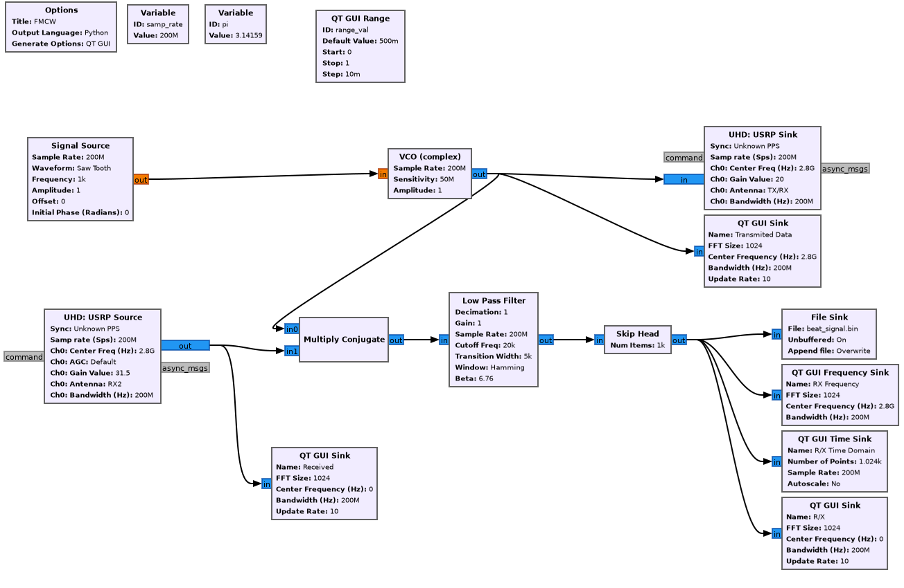
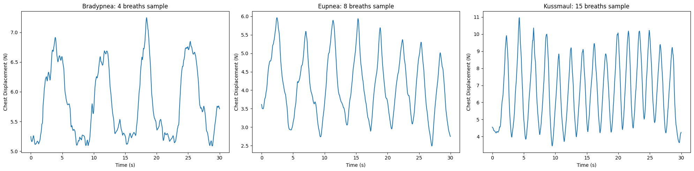

# Frequency Modulated Continuous Wave Radar Implementaion in GNURadio

### GNU-Radio Graph

### Blocks Information

1. Signal Source
    - **Sample Rate:** 25 MHz 
    - **Waveform:** Saw Tooth – Generates a linear frequency sweep for the VCO, essential for FMCW radar operation.
    - **Frequency:** 1 kHz – Sets frequency(inverse of chirp_duration) for the FMCW.
    - **Amplitude:** 1 – Strength to control Chirp Bandwidth.
    
2. Voltage Controlled Oscillation
    - **Sensitivity :** 12.5664M (rad/sec/V) = (2Mhz). This forms the chirp bandwidth necessary for range resolution and calculations related to FMCW.

    Modulates the the sinoid frequency based on the amplitude from Sawtooth Frequency.

3. Multiply Conjugate
    
    This block takes the conjugate of the transmitted signal (from the VCO) and multiplies it with the received signal, producing a beat frequency signal. This signal represents the frequency difference (beat frequency) between the transmitted and received signals, which is proportional to the range of the target.

4. USRP Settings
    - **Center Freq :** 2.8GHz (Converted to 28Ghz by UDbox)
    - **Bandwidth :** 100Mhz

### Respiration Belt Data

1. **Sample Rate:** 
   20 Hz

2. **Sensor Channel: Force Channel**; Measures chest displacement by detecting the force exerted during breathing.

Fig: Breathing Patterns as Captured by Respiration Rate.

### Signal Processing

1. **De-chirping the Received Signal:**
   The received signal is de-chirped by performing conjugate multiplication with the transmitted signal. This operation helps isolate the beat signal from the received signal for further processing.

2. **Decimation to Reduce Computational Load:**
   To optimize computational efficiency, the beat signal is decimated using the [scipy.signal decimate](https://docs.scipy.org/doc/scipy-1.15.0/reference/generated/scipy.signal.decimate.html) from 20 Mhz to 2 Mhz. As a result, each chirp is now represented by 2000 samples.

3. **Chirp Matrix Formation:**
   The decimated signal is reshaped into a chirp matrix with dimensions (total chirps, samples per chirp). This matrix provides the range profiles for target detection.

4. **Target Signal Extraction:**
   The signal component corresponding to the identified target is extracted across all chirps to obtain the slow-time signal. This extraction isolates the target's motion characteristics.

   
   
   Fig: Range FFT

5. **FFT on Slow-time Signal:**
   A Fast Fourier Transform (FFT) is performed on the slow-time signal to determine the frequency peaks corresponding to the target’s motion. By analyzing the frequency peaks within the range of 0.1-0.5 Hz (6-30 bpm), the breathing frequency of the target is identified.

    
    
    Fig: Detected Breath Rates for Eupnea Pattern