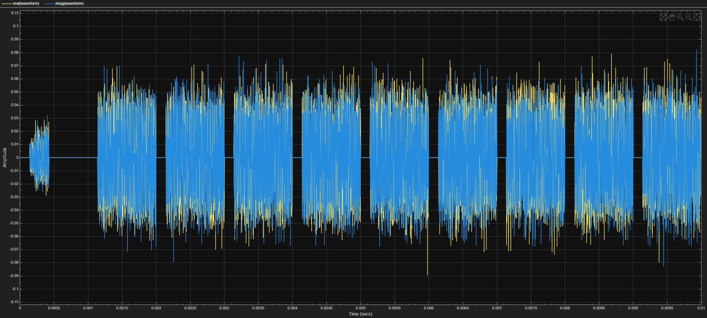
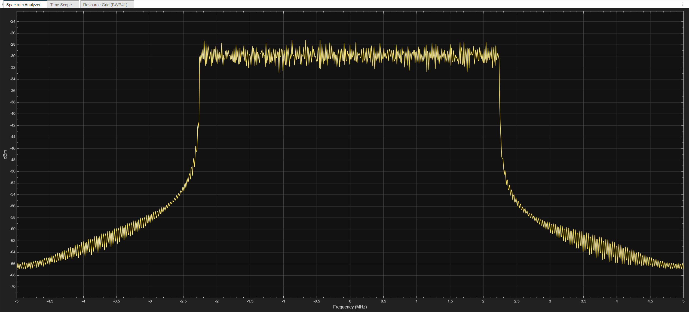

# 5G New Radio Implementation on mmWave 24Ghz

# Downlink FRC Configuration
A Downlink Fixed Reference Channel waveform for 5G NR is generatated using matlab using the following config

## Downlink FRC Parameters

| Parameter                 | Value                          |
|---------------------------|--------------------------------|
| **Frequency range**       | FR1 (410 MHz - 7.125 GHz)     |
| **MCS**                   | 64QAM, R=3/4                  |
| **Subcarrier spacing (kHz)** | 30                         |
| **Channel bandwidth (MHz)** | 10                          |
| **Duplex mode**           | FDD                            |
| **Subframes**             | 10                             |
| **Layers**                | 1                              |
| **Cell identity**         | 1                              |
| **RNTI**                  | 0                              |
| **OCNG**                  | Enabled                        |
| **Windowing source**      | Custom                         |
| **Windowing (%)**         | 0                              |
| **Sample rate source**    | Auto                           |
| **Phase compensation**    | Disabled (Unchecked)          |

---

## FRC Info

| Parameter                     | Value          |
|---------------------------------|--------------|
| **Subcarrier spacing (kHz)**    | 30           |
| **Allocated RBs**               | 24           |
| **Modulation**                  | 64QAM        |
| **Target code rate**            | 3/4          |
| **Payload (bits/slot)**         | 11784        |
| **PDSCH mapping type**          | A            |
| **Allocated symbols**           | [2, 12]      |
| **DM-RS configuration type**    | 1            |
| **Additional DM-RS positions**  | 2            |
| **First DM-RS position**        | 2            |
| **Rate matching overhead**      | 0            |

---

## Generated Signal Output

### Time Scope

### Spectorgram

### Resource Grids

