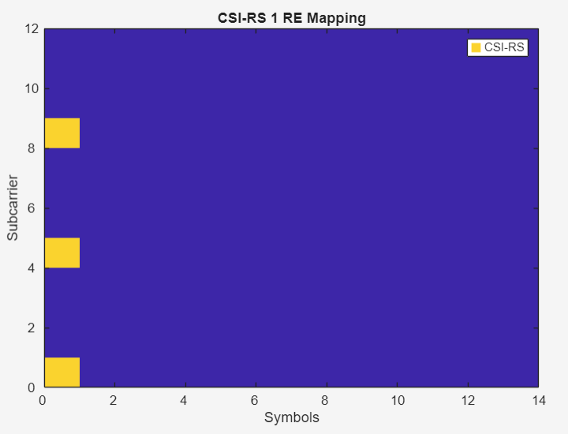

# **5G NR Waveform Configuration**

### General Settings

| Parameter                  | Value                                                |
| -------------------------- | ---------------------------------------------------- |
| Modulation                 | QPSK, R = 1/3; 16QAM R = 3/4; 64QAM R= 3/4 (To test) |
| Subcarrier Spacing         | 30 kHz                                               |
| Channel Bandwidth          | 20MHz                                                |
| Allocated Resource Blocks  | 51                                                   |
| PDSCH Mappting             | Type A                                               |
| Allocated Symbols          | [2 12]                                               |
| DM-RS config               | Type 1                                               |
| Additional DM-RS positions | 2                                                    |
| First DM-RS Position       | 2                                                    |
| Duplex Mode                | FDD                                                  |
| Subframes                  | 10                                                   |
| Layers                     | 1                                                    |
| Cell Identity              | 1                                                    |
| RNTI                       | 0                                                    |
| Windowing                  | Auto                                                 |
| Sample Rate                | 30.72MHz (Auto)                                      |
| Phase Compensation         | 2.8GHz                                               |

### SSB Config

| Parameter                   | Value                    |
| --------------------------- | ------------------------ |
| Block Pattern               | Case B                   |
| Transmitted Blocks          | [1 0 0 0]                |
| Period                      | 10 ms                    |
| Frequncy Offset             | Carrier Center           |
| SCS Common                  | 30                       |
| Payload                     | Master Information Block |
| Cell barred                 | No                       |
| Intra-frequency Reselection | No                       |
| PDCCH Config SIB1           | 0                        |

### PDSCH Config

| Parameter                 | Value    |
| ------------------------- | -------- |
| BWP ID                    | 1        |
| Num Layers                | 1        |
| Slot Allocation (0-Based) | [1 : 19] |
| Period                    | 20       |
| VRB Set                   | [0 : 50] |
| Coding Rate               | 0.3008   |
| Phase Tracking RS         | Enabled  |

### Coreset Config
| Parameter           | Value             |
| ------------------- | ----------------- |
| Frequency Resources | [1 1 1 1 1 1 1 1] |
| Duration            | 2                 |
| CCE-REG Mapping     | Non-Interleaved   |

### Search Space Config
| Parameter             | Value        |
| --------------------- | ------------ |
| Coreset ID            | 1            |
| Type                  | 'common'     |
| Start Symbol          | 0            |
| Slot Period           | 1            |
| Slot offset           | 0            |
| Duration              | 1            |
| Candidate Aggregation | [8 8 4 2 1]  |
| Label                 | SearchSpace1 |

### PDCCH

| Parameter          | Value        |
| ------------------ | ------------ |
| BWP ID             | 1            |
| Search Space ID    | 1            |
| Aggregation Level  | 8            |
| Candidate          | 1            |
| Allocated Slots    | [1 : 19]     |
| Period             | 4            |
| Coding             | Enabled      |
| Payload Size       | 20 bits      |
| Data Source        | PN9 Sequence |
| RNTI               | 0            |
| DMRS Scrambling ID | 1            |
| Label              | PDCCH1       |

### CSI-RS Config

| Parameter       | Value                |
| --------------- | -------------------- |
| BWP ID          | 1                    |
| Type            | non-zero power (nzp) |
| Periodic        | True                 |
| Period(slots)   | 4                    |
| Offset          | 0                    |
| Density         | 3                    |
| Symbol Location | 0                    |
| NRB             | 51                   |
| RB Offset       | 0                    |
| nID             | 1                    |
| Label           | CSIRS1               |

### Resource Grids
The generated signal consists of a single frame of duration 10ms, with resources allocated 
across 20 slots as shown in figure below.

and the individual Reource Elements are

#### PDCCH RE

#### PDSCH RE

#### CSI-RS RE

