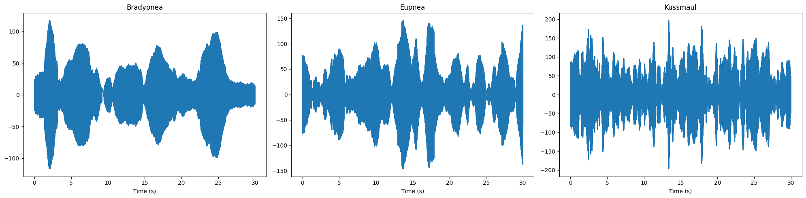
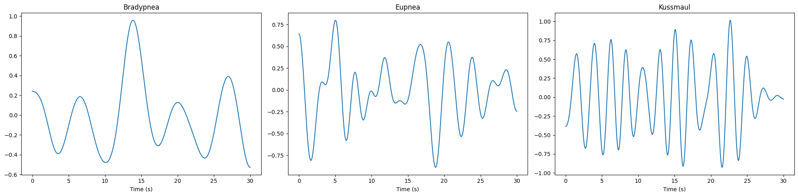

## Dataset Description

- The Dechirped Beat signal is converted to a chirp matrix of shape (num. samps per chirp, num. of chirps) for generating range profiles.
- Identifying the peak from the range profile the index is extracted across the matrix. This forms our slow-time signal.

<!-- Plots -->
### Raw Slow Time Signals

As shown in plots each type of respiration pattern shows a different plot
in slow-time signals, the number of breaths from this visualization can be clearly estimated. 
To further improve the isolation of respiration signal the slow-time signal is band-pass 
filtered at 0-0.55hz giving enough margin for our respiratory rate ranges from 3-15 breaths 
(0.1 - 0.5Hz) for 30 secs.

<!-- Plots -->
### Filtered Slow Time Signal

