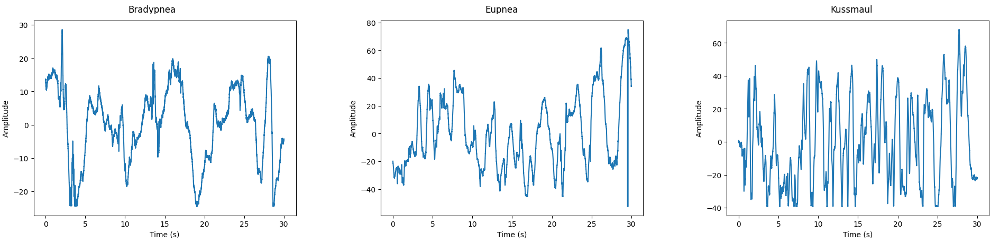

## Dataset Description

- The Dechirped Beat signal is converted to a chirp matrix of shape (num. samps per chirp, num. of chirps) for generating range profiles.
- Identifying the peak from the range profile the index is extracted across the matrix. This forms our slow-time signal.

### Files

- **slow_time_signals.csv :** Raw Slow time signals
- **filtered_slow_time_signals.csv:** Band-passed signals

<!-- Plots -->
### Raw Slow Time Signals

As shown in plots each type of respiration pattern shows a different plot
in slow-time signals, the number of breaths from this visualization can be clearly estimated. 

The raw signal is then smoothened using a median filter and detrending environmental drifts

This Signal is then EWT Decomposed into 3 modes to isolate the the breathing signal

Finally the amplitude variations due to environmental noise and other factors from the breating signal component of ewt are eliminated by using a Hilbert Transformation and normalizing amplitude jumps across the signal to get a more idealized breathing pattern.

## Results

### CNN

