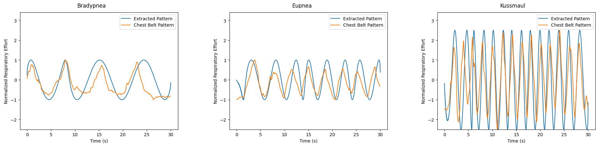

# 1. FMCW
## Dataset Description

- The Dechirped Beat signal is converted to a chirp matrix of shape (num. samps per chirp, num. of chirps) for generating range profiles.
- Identifying the peak from the range profile the index is extracted across the matrix. This forms our slow-time signal.

### Files

- **slow_time_signals.csv :** Raw Slow time signals used for processing.
- **filtered_slow_time_signals_final.csv:** Extracted Patterns

<!-- Plots -->
### Raw Slow Time Signals
<!--  -->

As shown in plots each type of respiration pattern shows a different plot
in slow-time signals, the number of breaths from this visualization can be clearly estimated. 

The raw signal is then smoothened using a median filter and detrending environmental drifts

This Signal is then EWT Decomposed into 3 modes to isolate the the breathing signal

Finally the amplitude variations due to environmental noise and other factors from the breating signal component of ewt are eliminated by using a Hilbert Transformation and normalizing amplitude jumps across the signal to get a more idealized breathing pattern.

## Results

### CNN

# 2.5G-NR dataset

The received signals undergo Frequency Offset Compensations for correcting the large environmental impairments on the waveform. This helps in correcting the phase-rotations and constellation correction for communications as well as Channel State Information Estimation.
We achieve a Communication Throughput of 11.42Mbps and average evm of 10-14%.

Above figure shows the summary of compensations and EVM for a typical sample.\
**Note: PDCCH EVM is offset by 150% due to waveform customisation.**

After the compensation steps we apply channel estimation on the Received Resource Grid for extracting the Channel state information (CSI) for respiration sensing. From the CSI we use the phase values of a subcarrier for further processing.

Above figure shows the phase caliberation steps for all 240 configured subcarriers for a biot's breathing sample. 
Although the phase patterns of different subcarriers overlap each other we see a sharp linear downward trend due to Sample Frequency Offset (SFO) and Sample Time Offset (STO). these are removed using linear transformation method. As seen from from 2nd plot we still notice some rapid phase fluctuations however magnifying on these caliberated phase patterns we can roughly see our biot's breathing pattern (3 breaths - apnea period - 2 breaths)

These large fluctuations are removed using a hampel filter. Hampel filter creates localized windows and clips the values to the specified std-devs value, eliminating the "outlier jumps" from the pattern. Further it is smoothened using a moving average filter remove the residual fluctuations after hampel filter.

A 7001 points window and a std-dev clipping of 0.1 is used for supressing fluctuations followed by a moving average, preserving the larger respiration pattern and smootheneing the phase.

Next steps follow similar logic as our FMCW impleentation for pattern extractions.

**EWTs for pattern isolation**

**Normalization with Hilbert and comparison to reference sensor data**

### Files
- ofdm_dataset.csv : extracted patterns of 5G only.
- synthetic_combined_dataset.csv : contains the extracted patterns from FMCW and 5G decimated to 600 points, along with Synthetic Generated samples through time-warping.

## Results

