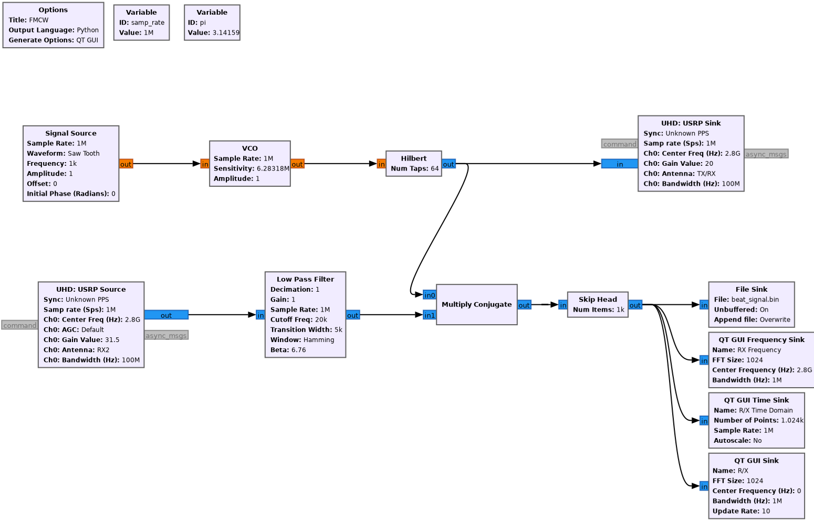

# Frequency Modulated Continuous Wave Radar Implementaion in GNURadio

### GNU-Radio Graph

### Blocks Information

1. Signal Source
    - **Sample Rate:** 1 MHz 
    - Waveform: Saw Tooth – Generates a linear frequency sweep for the VCO, essential for FMCW radar operation.
    - **Frequency:** 1 kHz – Sets the rate of frequency modulation.
    - **Amplitude:** 1 – Provides enough strength to control the VCO’s frequency shift.
    
2. Voltage Controlled Oscillation
    - **Sensitivity :** 506 (rad/sec/V). This forms the chirp bandwidth necessary for range resolution and calculations related to FMCW.

    Modulates the the sinoid frequency based on the amplitude from Sawtooth Frequency.

3. Low Pass Filter
    - **Cutoff Frequency:** 20 kHz – Filters out frequencies above 20 kHz, focusing on the beat frequency range.
    - **Transition Width:** 5 kHz – Defines the roll-off width, balancing sharpness and filter stability.

4. Multiply Conjugate
    
    This block takes the conjugate of the transmitted signal (from the VCO) and multiplies it with the received signal, producing a beat frequency signal. This signal represents the frequency difference (beat frequency) between the transmitted and received signals, which is proportional to the range of the target.

5. USRP Settings
    - **Center Freq :** 2.8GHz (Converted to 28Ghz by UDbox)
    - **Bandwidth :** 100Mhz
