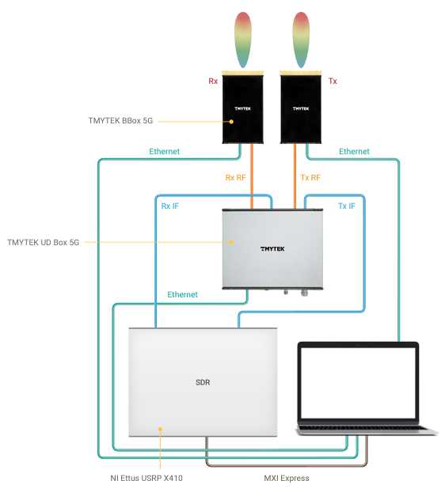

# AISECLAB mmWave Communication Sensing Implementation #

## References ##

- [Millimeter Wave Sensing A Review of Application Pipelines and Building Blocks](https://ieeexplore.ieee.org/abstract/document/9348922)
- [A Survey of mmWave-Based Human Sensing Technology Platforms and Applications](https://ieeexplore.ieee.org/abstract/document/10193776)

### Experimental Setup ###

## Signal Collection ##

- **Modulation Techniques:**
  - Frequency Modulated Continuous Wave(FMCW)
  - 29/60 GHz Probe.

- **IEEE Spectrum:**  802.11ad/aj/ay
  
- **Frequency:**
  - **60-69GHz:** Mobile Phones, Hand Gestures
  - **70-79GHz:** Human Position Tracking, allow greater range.

## Data Collection ##

- **Application:**

  - **Identificaion, position tracking, action recognition:**
    - Range, Velocity, angular information
  - **Health Monitor, speech acquisition**:
    - Phase, doppler shift.
  - **Object Detection**:
    - Signal Variations in Intermediate Frequency channels.

## Preprocessing ##

- **Range-Angle Spectrum:**
  
  - Obtained in FMCW method by Range-Angle FFT.
  - Complex Values in bins indicate the reflected signal from corresponding spatial position.
  - Phases represent the micro-displcements.
  - Uses: Object Detection.

- **Range-Doppler Spectrum**
  - Obained from Range-FFT to form the phase waveform.
  - Bin Values indicate moving objects and Velocities.
  - Uses: Object Separation and Velocity Approximaion.

- **Phase Waveform:**
  - Extracted from Range-Angle Spectrum or direct Range-FFT.
  - Used to identify micro-displacements (Heart Beats, Vitals.)
  - Uses: Fine-grained human sensing, vital sensing.

- **Point Cloud:**
  - Collection of Reflection Points repreenting surface objects

  **Calculated by algo:**
  

  Refer details at [pg.8](paper/A_Survey_of_mmWave-Based_Human_Sensing_Technology_Platforms_and_Applications.pdf)
