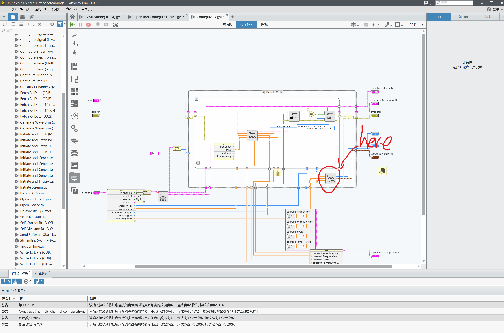

[Manual Book](https://www.ni.com/docs/en-US/bundle/usrp-2974-getting-started/page/overview.html#)

1. Go to [here](ni.com/info) and search NIPMDownload and download NI package management.
  
2. Use the NI package marnagement download LabVIEW Communications System Design Suite
  
3. Open the NI NXG. Now we can configure the USRP. [Labview NXG Start Video](https://www.youtube.com/watch?v=9lY_wgf4w40)

4. We can use the sample project in the template to familar with the USRP-2497.

> LabView NXG use G Web Development Software. [Getting Start with G Web](https://www.ni.com/docs/zh-CN/bundle/getting-started-with-labview-nxg/page/gslv.html)
>
> NI also has some examples in the github, which have more details.[GitHub Link](https://github.com/ni/webvi-examples)
>
> Don't know the reason why. The ip address of USRP-2497 must be set to **169.254.10.85**. Or the computer can't find the device
>
>For the example in the sample project. When you change the configuration of the USRP, you must restart the program or the change can't take any effect.

# Signal generating
In it's provided driver. They use **Generate Waveform** VI to generate the signal. We can modify this file to generate the signal we want.
 
 