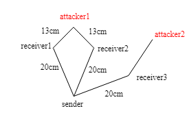

The most important thing in this experiment is to ensure that the sender is the same distance away from receiver1, receiver2, and attcker1 as well. 

The location of receiver3 and attacker2 is not important. In my experiment I set the distance between sender and receiver3 to 20cm.